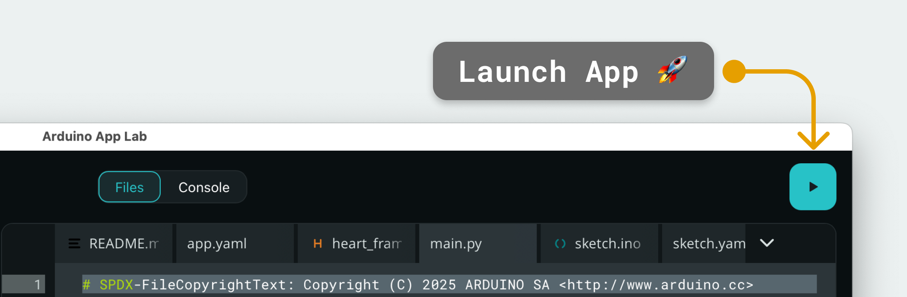

# MLF CoinDetector

**Proof of concept** for detecting and identifying **colored pucks** ("palets") from the live feed of a USB camera, running on an **Arduino UNO Q** with the **Arduino App Lab**.

The end goal is to send the identified pucks (color + position) to a **ROS robot** so it can locate and manipulate them. The ROS part is not implemented yet — this repository currently covers the perception stage only.

> ⚠️ **Status: proof of concept (POC).** The project started from the Arduino App Lab _"Detect Objects on Camera"_ example and is being adapted. The web UI (animations, texts) is still partly inherited from the original example.


## Overview

The USB camera feed is analyzed frame by frame by an **object detection model trained on [Edge Impulse](https://edgeimpulse.com/)**, running on the board through the `video_object_detection` Brick. Each detected puck (with its confidence score) is then pushed in real time to a web interface served by the `web_ui` Brick.

```
USB camera ──► video_object_detection (Edge Impulse model) ──► main.py ──► WebSocket ──► Web UI
                                                                  │
                                                                  └──► (planned) publish to a ROS robot
```

## Model

The detection model is trained and exported from **Edge Impulse**, then referenced in [`app.yaml`](app.yaml):

```yaml
bricks:
  - arduino:video_object_detection:
      model: ei-model-1054574-2
  - arduino:web_ui: {}
```

To retrain / update the model, edit the corresponding Edge Impulse project and replace the model id above.

## Bricks Used

- **`video_object_detection`** — runs object detection on the camera feed using the Edge Impulse model.
- **`web_ui`** — serves the web interface and handles real-time (WebSocket) communication with the backend.

## Hardware and Software Requirements

### Hardware

- [Arduino® UNO Q](https://store.arduino.cc/products/uno-q) (or Arduino VENTUNO Q)
- USB camera (x1)
- USB-C® hub adapter with external power (x1) _(UNO Q only)_
- A power supply (5 V, 3 A) for the USB hub, e.g. a phone charger _(UNO Q only)_
- A personal computer with internet access

### Software

- Arduino App Lab

> **Note:** the App must be run in **Network Mode** in the Arduino App Lab, since it requires a USB-C hub and a USB camera.

## How to Use

1. Connect the USB-C hub to the UNO Q, then plug the USB camera into the hub.
   
2. Attach the external power supply to the USB-C hub to power everything.
3. Run the App from the Arduino App Lab.
   
4. The App opens automatically in the browser. You can also open it manually at `<board-name>.local:7000` (or `<board-ip-address>:7000`).
5. Present colored pucks in front of the camera and watch the detections update in real time.

## How It Works

### 🔧 Backend — [`python/main.py`](python/main.py)

- Initializes the Bricks:
  - `ui = WebUI()` — channel to push messages to the frontend.
  - `detection_stream = VideoObjectDetection(confidence=0.5, debounce_sec=0.0)` — runs detection on the video stream.
- Wires detection events to the UI via an `on_detect_all` callback: for each detected object, sends `{ content, confidence, timestamp }` on the `detection` channel.
- Listens for the `override_th` message to adjust the **confidence threshold** on the fly.
- Keeps everything alive with `App.run()`.

```python
ui = WebUI()
detection_stream = VideoObjectDetection(confidence=0.5, debounce_sec=0.0)

ui.on_message("override_th", lambda sid, threshold: detection_stream.override_threshold(threshold))

def send_detections_to_ui(detections: dict):
    for key, values in detections.items():
        for value in values:
            ui.send_message("detection", message={
                "content": key,
                "confidence": value.get("confidence"),
                "timestamp": datetime.now(UTC).isoformat(),
            })

detection_stream.on_detect_all(send_detections_to_ui)
App.run()
```

### 💻 Frontend — [`assets/index.html`](assets/index.html) + [`assets/app.js`](assets/app.js)

- **Video feed**: an iframe retries `/embed` until the camera stream is available.
- **Threshold control**: a slider + numeric input + reset button adjust the confidence threshold live (`override_th`).
- **Recent detections**: shows the last 5 detections with percentage and timestamp.
- **Connection status**: shows an error banner if the WebSocket connection drops.

## Roadmap

- [x] Detect colored pucks with an Edge Impulse model on the UNO Q
- [x] Real-time visualization in the web UI
- [ ] Extract the position of the pucks in the frame
- [ ] Publish the identified pucks (color + position) to a **ROS robot**
- [ ] Fully adapt the web UI to the use case (remove leftovers from the example)

## Credits

Based on the Arduino App Lab _"Detect Objects on Camera"_ example.
Detection model trained with Edge Impulse.
